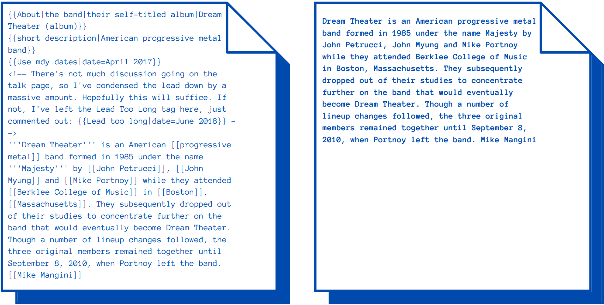

<br />
<p align="center">
  <a href="https://github.com/iwasingh/Wikicompiler">
    
  </a>

  <h3 align="center">Wikicompiler</h3>

  <p align="center">
    The wikipedia compiler
    <br />
    <br />
    <br />
  </p>
  <p align="center">
   
  </p>
</p> 

# Wikicompiler

Wikicompiler (a.k.a WCC) is a fully extensible library that helps you to compile [Wikitext](https://www.mediawiki.org/wiki/Wikitext). For example you can do text analysis, text extraction, document preprocessing and so on. In fact this library implements a recursive descent parser that parse and evaluate(you can custumize this process if you want) the wikicode. Check out the examples


## Requirements
* Python >= 3.6

## Basic Usage
Extracts clean text
```python
 from wikicompiler import compiler as c
 
 wcc = c.Compiler()
 wcc.compile(text)
 
```
You can listen specific events emitted by the compiler. Let's say you want to grab all the links from a page:

```python
 links = []
 wcc.on(lambda node: links.append(node), c.ParseTypes.LINK) 

```
Done! Checkout the examples section for more infos [Examples](https://github.com/iwasingh/Wikicompiler/tree/master/examples)

### AST

If you want the AST instead, you can do the following way
```python
 from wikicompiler import parser.parser as p
 
 text="==Hello World=="
 parser = p.Parser()
 ast = parser.parse(text)

```
Then you can visit that AST and consider to write your own evaluator yourself.

### Grammar
You can pass your own grammar to the parse and evaluate the AST yourself. Furthermore you can use combinators to write your own rules checkout the [Grammar](https://github.com/iwasingh/Wikicompiler/blob/master/parser/grammar.py) and the [combinators](https://github.com/iwasingh/Wikicompiler/blob/master/utils/combinators.py)

```python

 class MyGrammar:
  # This is important! The parser will consider this as a starting symbol
  def expression(self):
    # Must return a function that accept a parser
    return seq(expect(Heading2.start), self.mytext, expect(Heading2.end))
  
  def mytext(self):
    return p.Node(p.TextP('My static node'))
    
 
 parser = Parser(grammar=MyGrammar.expression())
 parser.parse(text)
```
### Lexer
You should checkout the symbols definitions(https://github.com/iwasingh/Wikicompiler/blob/master/lexer/symbols.py) and the [lexer symbols definition](https://github.com/iwasingh/Wikicompiler/blob/master/lexer/lexer.py#L208). WCC adds some basic symbols, you can extend the symbol table, obviously you have to change grammar too.
Basically you first have to define a symbol (tag)
```python
from wikicompiler import lexer.lexer as l
from wikicompiler import lexer.symbols as s
class MyCustomTag(s.Tag):
    start = s.Token('LINK_START', r'\[\[')
    end = s.Token('LINK_END', r']]')

    def __init__(self):
        super().__init__(MyCustomTag.start, MyCustomTag.end)

# And then define the symbol in the table

@l.definition(l.Symbol.RESERVED)(MyCustomTag)

# Or if you need to do other things when matching the token
@l.definition(l.Symbol.RESERVED)
class MyLexCustomTag(MyCustomTag):
 def __init__(self):
   super().__init__()
 def match(self, text, pos, **kwargs):
   # Do something
   # Must return (Match, Token)
```

## Notes
Wikitext cannot be solved by a context-free parser (the one implementend in this library) because Wikitext is based upon a context-sensitive grammar.
But for most of the use cases, grammar rules can be simplified with a little information loss. For example, Templates are simplified and ignored by default in the evaluation, but its node is considerated anyway, that means you can parse the template (text inside of it) in your own manner when you reach that node. If you really need a result similar to the wikipedia actual page rendered in the browser, you should checkout [mediawiki specification](https://www.mediawiki.org/wiki/Markup_spec) or use their api directly that gives you the page properly rendered.
## License
[MIT](https://github.com/iwasingh/Wikicompiler/blob/master/LICENSE)
